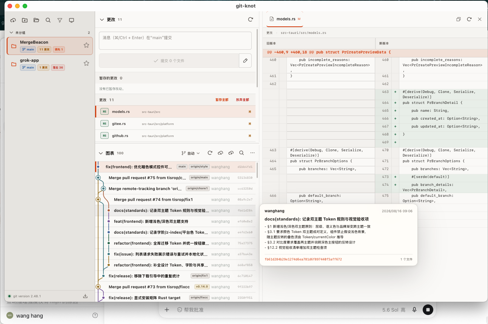
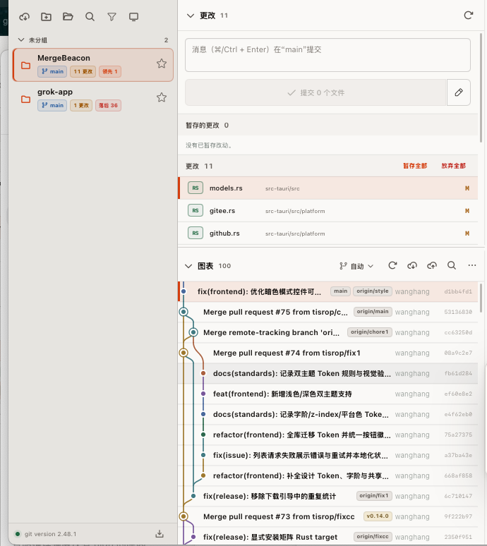
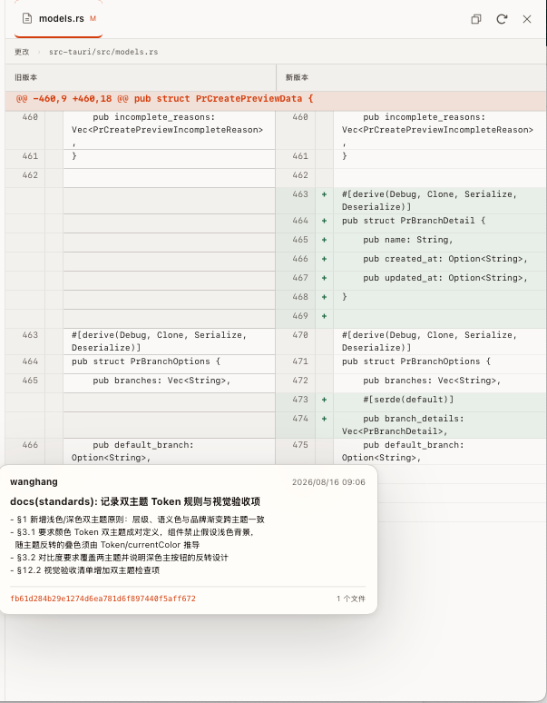

# git-knot

一个从零构建的 Tauri 2 + Rust + React + pnpm 跨平台 Git 桌面客户端。

详细分层、Git 执行模型、持久化、安全边界、GitHub-only 更新方案和实施顺序见
[`docs/architecture.md`](docs/architecture.md)。

## 致谢

感谢 [Git UI Pro](https://github.com/zjx150504-lgtm/Git_UI_Pro) 项目提供的产品思路、交互参考和界面启发。

`git-knot` 是一个基于 Tauri 2 + Rust + React + pnpm 从零构建的独立项目，不迁移 Git UI Pro 的 Electron 进程模型、配置、凭据或安装数据。

## 界面预览

### 工作台总览

仓库列表、工作区变更、提交历史和文件 Diff 集成在同一个紧凑工作台中。



### 提交历史与变更文件

提交树支持展开提交涉及的文件，文件列表与提交历史保持连续滚动布局。



### 左右 Diff 视图

选择文件后，在右侧查看左右对比 Diff，并保留提交元数据和文件路径信息。



## 当前垂直切片

- 使用原生目录选择器添加本地 Git 仓库；
- 将项目列表保存到应用数据目录的版本化 JSON，并支持按名称、路径或分组搜索、收藏置顶与分组管理；
- 通过 Rust 调用系统 Git；
- 显示 Git 版本、分支、上游、ahead/behind 和工作区文件状态；
- 展示 staged、unstaged、untracked 和 conflict 工作区分组，并支持文件级 diff；
- 安全选择冲突文件的 Git index stage 2（当前侧）或 stage 3（传入侧）版本：预览受 1 MiB 与文本格式限制，写入前用覆盖 index 与工作区的快照 token 防止采用过期内容；缺失侧表示删除文件，submodule/gitlink 和自定义合并编辑暂不支持；
- 支持识别已有 `MERGE_HEAD` 的普通 merge，并通过独立 Preview/Continue/Abort 合同恢复：会话私有 token 覆盖 HEAD、MERGE_HEAD、分支、porcelain status、完整 index、staged/worktree binary diff 和 `MERGE_MSG`；Continue 要求冲突全部解决且没有未暂存或未跟踪更改，普通 commit 不能旁路，Abort 会明确提示本地更改丢失风险；rebase、cherry-pick、Revert sequencer Continue/Skip 和通用 sequencer 恢复仍不支持，详细边界见 `docs/adr/0023-safe-merge-conflict-recovery.md`；
- 支持 stage/unstage 单文件和全部文件，并通过二次确认安全放弃单个或最多 256 个未暂存文件；批量执行会在 Rust 写锁内重新校验完整列表，保留同一文件已暂存的版本；
- 支持只提交已暂存内容的 commit，提交消息通过 Rust 子进程 stdin 传递；
- 支持对当前 attached 本地分支的 `HEAD` 执行安全 Amend：Preview/Confirm token 绑定分支、HEAD、原 author/parents、提交信息、阻塞引用、完整 index 与 staged binary diff；未发布 HEAD 可仅在本地修改；若唯一已发布引用是精确指向旧 HEAD 的当前 upstream，则可通过专用确认执行 Amend + 精确 `force-with-lease` 安全强推。标签、其他远端引用、Detached/unborn/冲突及 merge、rebase、cherry-pick、revert 进行中均拒绝；执行使用 `write-tree`、`commit-tree` 与 expected-old-OID `update-ref`，允许仅修改信息且不执行 commit hooks、编辑器或本次签名；
- 支持从历史详情安全撤销当前本地分支历史中的普通单父提交：Preview/Confirm token 绑定分支、HEAD、目标 OID、parent 和 subject，要求工作区完全干净且没有其他 Git 流程；固定创建一个新的 Revert 提交，不删除或改写原历史，冲突时自动尝试 `git revert --abort`；root/merge commit、任意 revision、mainline、自定义消息和 Revert Continue/Skip 不支持，详细边界见 `docs/adr/0030-safe-single-parent-commit-revert.md`；
- 支持把完整 OID 对应的普通单父提交 Cherry-pick 到当前 attached 本地分支：预览和执行都要求工作区、暂存区完全干净且没有其他 Git 流程，确认 token 绑定当前分支、HEAD、目标提交与 subject；冲突时自动尝试 `git cherry-pick --abort`，merge commit、mainline、自定义提交消息和 Continue/Skip 不支持；
- 支持对当前 attached 本地分支执行 `--soft`、`--mixed` 或 `--hard` Reset：预览和执行都要求工作区、暂存区完全干净，并在 Rust 写锁内重新校验分支、HEAD、目标、模式和快照 token；当前 HEAD 一旦被任一远端跟踪分支包含或被标签引用即拒绝 Reset，必须改用 Revert。Hard Reset 会同步 index 与已跟踪文件，但不会删除未跟踪文件；
- 读取本地/远端分支与远端地址，支持安全切换、从当前提交创建并切换本地分支、从历史中的精确 commit OID 创建但不切换本地分支、从已读取的远端分支创建本地跟踪分支，以及安全删除非当前本地分支；未合并分支必须经过升级后的不可恢复警告再次确认；
- 支持安全创建、编辑和删除 Remote：名称与 URL 由 Rust allowlist 校验，HTTPS 禁止嵌入凭据，地址只以脱敏形式返回 React；编辑使用留空保持原值，更新和删除通过快照 token 拒绝外部 Git 造成的过期操作，删除前预览受影响的本地 upstream；不支持 Gitee、Remote rename 和多 URL Remote 编辑；
- 支持把一个已读取的非当前本地分支安全合并到当前本地分支：先预览 ahead/behind 与提交关系，只开放仅快进或创建合并提交两种策略；要求工作区完全干净，冲突时自动尝试 `git merge --abort`；
- 读取并管理标签：本地创建只接受已读取提交的精确 OID，支持轻量与附注标签，说明通过 stdin 传递；本地删除使用 full ref 和预期旧 OID；可把一个本地标签 create-only 发布到单一 Push URL Remote，同值幂等、不同值拒绝覆盖；远端删除必须先预览精确 OID，再以 token 和 expected-OID lease 确认，不删除本地标签或提交；当前不支持签名标签、批量远端标签或 Gitee；
- 读取并管理本地储藏：支持创建、Apply、Pop 和 Drop，以及 include untracked、keep index 和 restore index 选项；界面只展示 `stash@{n}` selector，所有 mutation 只提交精确 stash commit OID，Rust 在写锁内重新解析当前 selector 并二次校验；
- 读取 `git worktree list --porcelain -z` 的权威工作树清单，展示主/关联、分支或 Detached HEAD、HEAD、锁定原因与 prunable 警告；可从 Rust 已读取且尚未检出的 exact 本地分支创建关联工作树，目标固定由 Rust 推导到主仓库同级 `.git-knot-worktrees` 受控目录，并继续支持使用精确路径和会话私有快照 token 锁定/解锁安全记录；失效记录可用整份清单 `pruneToken` 二次确认后执行固定 prune；不接受任意路径/ref/revision，move、remove 和 repair 仍未开放，详细边界见 ADR 0026、ADR 0027 与 ADR 0029；
- 读取当前 index 中 mode `160000` 的直接 Submodule 清单，并结合受限 `.gitmodules` 配置、目标 OID 和已验证 checkout 的 HEAD/工作区状态展示 clean、modified、uninitialized、conflicted 与 unsafe；`.gitmodules` 和 checkout 路径拒绝 symlink，URL 返回前脱敏，不执行 init/update/sync、网络访问或递归遍历，详细边界见 `docs/adr/0028-read-only-submodule-inventory.md`；
- 支持针对已配置远端的 fetch、当前分支 upstream-only 的安全 Pull 和非强制 Push；当前本地分支没有 upstream 时，可将其 create-only 发布为远端新分支并设置 upstream；提交菜单中的“提交和推送”与独立“推送”都可选择一个已读取的远端分支，或输入要新建的远端分支，并在成功后设置 upstream，独立 Push 不要求工作区存在变更或填写 Commit Message；这些网络操作都提供 operation ID、结构化进度、显式取消、5 分钟总超时和进程树清理；Pull 只执行 fetch + `merge --ff-only`，已有 upstream 的 Push 只推送当前分支，分叉或非快进时拒绝操作；
- 支持从 HTTPS、SSH 和 SCP-like SSH 地址克隆 GitHub、GitLab 等远端仓库；Clone 使用 Rust 推导目录名、staging 目录和原子落盘，支持结构化进度、取消、超时和进程树清理；不支持 Gitee、HTTP、带凭据 URL、query/fragment 或自定义 Git 参数；
- 读取当前 `HEAD` 或一个已存在的本地分支、远端跟踪分支、标签可达的提交历史；Rust 只接受 exact full ref 并解析为 commit OID，不开放任意 revision 或 `--all`；未筛选结果使用 parent OID 绘制受限提交图并显示 branch/tag decorations，筛选结果降级为离散节点，通过 `hasMore/nextOffset` 继续加载；详细边界见 `docs/adr/0025-bounded-ref-aware-commit-graph.md`；
- 展示提交文件列表、重命名原路径和 patch，merge commit 采用 first-parent diff；
- 历史查询单页限制为 1～200 条，使用 `limit + 1` 判断下一页，单次输出限制为 4 MiB；不接受任意 revision、分支/ref、`--all` 或 Git 参数；提交标识和 patch 也设置输入与资源上限；
- 支持带示例仓库的浏览器 Mock Bridge，并与 Tauri Bridge 分离。

## 已接受的关键决策

- 系统 Git CLI 是主要 Git 后端；
- React 只能通过 `DesktopApi` 使用桌面能力；
- 跨进程 TypeScript DTO 由 Rust 自动生成；`contract.ts` 只保留手写 API 方法合同，`pnpm run check:bindings` 阻止生成文件漂移；
- 应用更新只使用 `tisrop/git-knot` GitHub Releases：安装版支持后台检查、签名验证、下载进度和安装后重启，不支持 Gitee；
- Windows 便携 ZIP 更新流程仍在规划中；当前应用不提供便携版下载或打开入口，也未引入 opener 权限；
- updater endpoint 和签名公钥已固定；`pnpm run check:update-policy` 会阻止更新源、公钥、插件依赖或 GitHub-only 策略漂移。
- GitHub Release 元数据可通过 `pnpm run validate:github-release -- ...` 校验版本、Tag、签名、规范下载地址和资产唯一映射，具体参数见 `docs/release.md`。
- 同一仓库的写操作通过 Rust application 层串行化，不同仓库可以并行；Pull 的 fetch 与快进阶段共享同一个 5 分钟 deadline，Push 复用同一长任务边界。
- 单文件和批量放弃统一使用精确文件路径 API；Rust 在任何 mutation 前重新读取 status 并校验完整列表，拒绝冲突、仅暂存、重复和过期条目。tracked restore 与 untracked clean 是两个阶段，失败后界面刷新权威状态，不宣称跨进程事务。
- 分支切换只接受 Rust 重新读取后确认存在的本地 full ref；远端 URL 返回前会去除凭据、查询参数和片段。
- 发布分支只允许当前 attached 且尚无 upstream 的本地分支，并在仓库写锁内重新校验 full ref、OID、远端和目标分支名；远端存在性检查与 Push 共用同一个 5 分钟 deadline，Push 使用 `--force-with-lease=refs/heads/<name>:` 空期望 lease，仅在目标远端分支不存在时创建并设置 upstream，拒绝覆盖任何已存在的远端分支。
- 提交菜单的目标 Push 同样只接受当前 attached 本地 full ref、已配置 Remote、经 Git 校验的远端短分支名和提交后的精确 OID。选择现有远端分支时，Rust 会核对本地远端跟踪引用和服务端 OID、验证目标是当前提交的祖先，再使用 expected-OID lease 执行快进更新；选择新分支时使用空期望 lease，仅允许 create-only。两种模式都会在成功后把所选目标设置为 upstream，引用变化、非快进或同名竞态创建都会停止 Push。
- Remote 创建、更新和删除统一进入仓库写队列；编辑与删除先获取覆盖地址和受影响 upstream 的快照 token，执行时配置已变化则拒绝。删除会移除本地远端跟踪引用和相关 upstream 配置，但不会删除服务器上的分支；详细边界见 `docs/adr/0021-safe-remote-management.md`。
- 从历史提交创建分支只接受 40/64 位精确 commit OID 和经 Git 校验的分支名，固定创建 `refs/heads/*` 且不切换 HEAD；`update-ref` 使用“引用必须不存在”的条件写入，避免外部进程竞争时覆盖已有分支。
- 分支删除同样只接受 Rust 在写锁内重新确认的本地 full ref；当前分支和远端分支不能删除，未合并分支只有二次确认后才使用受控的强制删除。
- 本地分支合并只允许 `refs/heads/*` 合并到当前 attached local branch。预览用于解释提交关系，真正 mutation 会在仓库写锁内重新读取 refs/status/ancestry，并使用权威 target OID 执行；不支持任意 revision、远端 ref、无关历史、squash、rebase 或自定义 strategy。
- 未完成 merge 的 Continue/Abort 使用独立会话私有快照 token；Continue 关闭 editor、terminal prompt 和本次 commit GPG signing，Abort 作为危险操作明确提示 tracked 更改可能丢失。普通 commit 在 Rust 层检查 `MERGE_HEAD` 并拒绝旁路；详细边界见 `docs/adr/0023-safe-merge-conflict-recovery.md`。
- Amend 与普通 commit 使用独立 API。Amend 只作用于当前 attached `refs/heads/*` 的精确 HEAD，不接受 revision 或 ref 参数；mutation 在写锁内重新校验 token，创建替换 commit 后用 expected-old-OID compare-and-swap 更新分支。应用内 mutex 不阻止外部 Git；CAS 失败时原 HEAD 不会被应用覆盖，但新对象可能成为 dangling object；详细边界见 `docs/adr/0024-safe-head-amend.md`。
- 已发布 HEAD 的 Amend 使用另一条受限长任务 API，只接受当前分支配置的 upstream，要求本地远端跟踪引用与服务器目标都精确等于旧 HEAD，且不存在标签或其他远端引用。Push 固定使用 `--force-with-lease=refs/heads/<upstream>:<old-head>`，不开放任意 refspec 或 force 参数；远端竞态会停止覆盖。若本地 Amend 已成功而 Push 因网络、权限、保护规则或 lease 失败，本地新提交会保留并向界面报告部分成功，不自动回滚。
- Revert 与 Amend、merge recovery 使用独立 API。Revert 只接受当前分支历史中的完整单父 commit OID，在写锁内重做 clean/status/ancestry/parent 检查并校验会话 token，再固定执行 `revert --no-edit --no-gpg-sign`；失败若留下 `REVERT_HEAD` 会自动尝试 abort。该操作不改写历史，也不开放 merge mainline、任意 revision 或 sequencer Continue/Skip；详细边界见 ADR 0030。
- Cherry-pick 与 Reset 使用独立 Preview/Confirm API，均只接受完整 commit OID、attached 本地分支和干净工作区，并在 mutation 时重新生成会话 token 以拒绝过期确认。Cherry-pick 仅支持普通单父提交，固定关闭本次 GPG signing，冲突时自动尝试 abort；Reset 不允许改写已被远端跟踪引用包含或被标签引用的当前 HEAD。`--soft`、`--mixed`、`--hard` 只决定目标提交之后内容在 index/工作区中的保留方式，不构成绕过已发布历史保护的开关。
- 标签创建只接受 Rust 重新确认的 commit OID 和经 `check-ref-format` 校验的名称；附注说明限制为 64 KiB，当前固定关闭 `tag.gpgSign`。本地删除只接受权威 `refs/tags/*`，并通过 expected-old-OID compare-and-swap 防止删除已被外部移动的引用。远端发布固定关闭 `push.followTags` 并使用空期望 lease 防覆盖；远端删除使用预览 token 与服务端 expected-OID lease，详细边界见 `docs/adr/0022-safe-remote-tag-management.md`。
- 储藏 selector 仅用于展示；Apply、Pop 和 Drop 只接受 40/64 位精确 OID。Rust 在仓库写锁内重新读取 reflog、拒绝 OID 重复，并在执行前用当前 selector 再次验证对象。Apply/Pop 失败可能已经部分修改工作区，因此界面必须重新读取 status 和 stash 列表；Pop 冲突时保留原储藏。
- 工作树清单只从 `--porcelain -z` 解析，第一条记录按 Git 语义标记为主工作树。创建候选由 exact `refs/heads/*`、OID、已检出分支集合和 Rust 推导路径组成，mutation 在写队列内重读 token 后固定执行 `git worktree add`；失败时只清理本次创建且未注册的受控目标。lock/unlock 继续按 exact path 和覆盖 HEAD、分支及状态的 token 校验；对 Git 标记为 `prunable` 的失效记录，可在整份清单 `pruneToken` 二次确认后执行固定的 `git worktree prune --expire=now`，只清理管理记录，不删除有效工作树文件。Git worktree mutation 没有跨进程 CAS，因此所有操作后都重新读取权威清单；详细边界见 ADR 0026、ADR 0027 与 ADR 0029。
- Submodule 首个切片只读取 index gitlink、受限 `.gitmodules` 字段和直接 checkout 状态；路径逐级拒绝 symlink，嵌套 Submodule 始终被忽略，Remote URL 按同一规则去除凭据、query 和 fragment。当前没有 Submodule mutation、网络操作或递归清单；详细边界见 ADR 0028。
- Git 网络长任务与其他写操作复用仓库级队列；所有 Git 子进程 stderr 只在 Rust 内用于受限分类，不会原样写入前端错误消息。前端只接收稳定错误码、受控提示，也不会接收带凭据的远端 URL。
- Clone 的最终目标路径由 Rust 从远端地址末段推导，同一目标路径串行化；失败或取消只清理本次创建的 staging 目录，不删除用户已有目录。
- 历史范围默认为当前 `HEAD`，也可选择 Rust 已确认存在的 `refs/heads/*`、`refs/remotes/*` 或 `refs/tags/*` 完整引用；最终传给 `git log` 的是内部解析出的 exact commit OID。提交信息和作者使用大小写不敏感 fixed-string，日期必须是有效的 `YYYY-MM-DD`，文件筛选只能是 `--` 后的仓库相对 literal path。筛选变化或 ref 变化从 offset 0 重新读取；筛选时提交图不声称连续拓扑，外部 Git 移动 ref 时 offset pagination 不构成稳定快照。

## 开发

```bash
pnpm install
pnpm tauri dev
```

仅预览 React 界面：

```bash
pnpm dev
```

Rust DTO 变更后重新生成 TypeScript 合同：

```bash
pnpm run generate:bindings
```

## 验证

```bash
pnpm run check:update-policy
pnpm run check:bindings
pnpm typecheck
pnpm test
pnpm build
cargo test --manifest-path src-tauri/Cargo.toml
cargo check --manifest-path src-tauri/Cargo.toml
cargo clippy --manifest-path src-tauri/Cargo.toml --all-targets -- -D warnings
cargo fmt --manifest-path src-tauri/Cargo.toml --all -- --check
pnpm tauri build --debug
```
