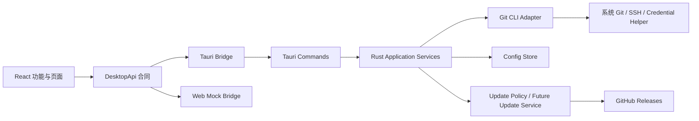

# git-knot 架构方案

## 1. 项目定位

git-knot 是一个从零构建的跨平台 Git 桌面客户端。技术栈固定为：

- Tauri 2：桌面容器、窗口、系统能力和发布更新；
- Rust：Git、文件系统、配置、凭据协调和长任务；
- React + TypeScript：界面与交互状态；
- Vite + pnpm：前端开发、构建和依赖管理。

旧 `/Users/wanghang/rustprojects/Git_UI_Pro` 只用于核对功能和交互，不迁移 Electron 进程模型、IPC 合同、配置、凭据或安装数据，也不保留 Electron 兼容层。

## 2. 总体分层



### React 层

- `src/app`：应用壳、路由、全局布局和顶层状态；
- `src/features`：按仓库、工作区、提交、分支、远端、设置和更新拆分功能；
- `src/platform/desktop`：唯一桌面能力边界；
- 组件不得直接调用 `invoke`、Tauri 插件或任意 shell。

### Rust 层

- `commands`：窄而稳定的 Tauri 命令入口，只处理参数、状态提取和错误映射；
- `domain`：跨进程 DTO、领域值对象和业务规则；
- `application`：用例编排、仓库级写操作串行化、取消和进度事件；应用收到退出请求时统一取消仍注册的长任务；
- `infrastructure/git`：系统 Git CLI 适配器及机器可解析输出；
- `infrastructure/config`：版本化配置、原子写入和恢复；
- `infrastructure/update`：GitHub-only 更新检查与安装策略。

当前本地工作区（包括安全选择冲突的 Git index stage 2/3 版本、普通 merge 的安全 Continue/Abort 和安全单父提交 Revert）、分支（包括安全本地合并和从精确历史提交创建但不切换的本地分支）、本地与远端标签、储藏、关联工作树清单、安全创建、lock/unlock 与失效记录 prune、直接 Submodule 只读清单、Remote 增删改写操作，以及 fetch、安全 Pull、安全 Push 和 Clone 已通过 `RepositoryService` 编排：Tauri command 只负责参数、状态和错误边界，`application` 层负责仓库根目录解析、同仓库写队列、长任务注册与取消。网络操作通过 operation ID 和事件推送结构化进度，任意终态由前端按功能刷新权威数据或展示 Rust 返回的确认载荷；应用退出请求不会依赖组件卸载，而是由 Tauri run event 统一触发取消。Clone 还负责在成功后把新仓库写入项目配置。

## 3. 跨进程合同

React 只依赖 `DesktopApi`：

```text
Feature/UI -> DesktopApi -> TauriBridge -> invoke(command) -> Rust
                  └------> WebMockBridge（浏览器预览与组件测试）
```

规则：

1. Rust DTO 是权威类型源；
2. 跨进程 TypeScript DTO 由 `ts-rs` 生成到 `src/platform/desktop/generated/domain.ts`，`contract.ts` 只保留手写的 `DesktopApi` 方法合同并重新导出生成类型；
3. `pnpm run check:bindings` 对生成文件做逐字节防漂移校验，并已纳入 `pnpm run check`；
4. 错误使用稳定的 `code + message` 结构，UI 根据 code 决定恢复动作；
5. 长任务使用请求 ID、进度事件和显式取消，不依赖窗口卸载隐式终止；
6. 前端不能提交任意 Git 参数或命令字符串。

## 4. Git 执行模型

主要后端使用系统 Git CLI，而不是在首期引入完整 libgit2 实现。

原因：

- 与用户已有 Git 配置、SSH、credential helper、LFS、hooks、签名、submodule 和 worktree 行为一致；
- Git 的稳定机器接口（例如 porcelain v2、`for-each-ref` 和指定格式 `log`）适合 Rust 解析；
- 降低“双 Git 实现”带来的行为差异和维护成本。

约束：

- 使用 `git -C <repo>`，不修改进程全局当前目录；
- 只读命令设置 `GIT_OPTIONAL_LOCKS=0`；
- 参数由 Rust 构造，不经过 shell 拼接；
- 仓库级写操作串行化，不同仓库可以并行；
- 工作树清单固定使用 `git worktree list --porcelain -z`，第一条记录标记为主工作树；创建只允许 Rust 从尚未检出的 exact `refs/heads/*` 与 OID 生成候选和会话 token，目标固定推导到主仓库父目录下 `.git-knot-worktrees/wt-<repo>-<hash>/wt-<branch>-<hash>`，React 不提交路径、revision 或 Git 参数。以 canonical `--git-common-dir` 为写队列 key，在队列内重读候选后执行固定 `git worktree add`，失败只 best-effort 清理本次创建且未注册的目标。lock/unlock 继续只接受已读取记录的 exact absolute path 与 token；主、bare 和 prunable 记录只读。对 Git 标记为 `prunable` 的失效记录，可在整份权威清单 `pruneToken` 二次确认后固定执行 `git worktree prune --expire=now --verbose`，只清理管理记录，不删除有效工作树文件；move、remove 和 repair 仍不支持。Git worktree mutation 没有跨进程 CAS，详见 ADR 0026、ADR 0027 与 ADR 0029；
- Submodule 清单只读取当前 index 中 mode `160000` 的直接 gitlink、`.gitmodules` 的 `path/url/branch` 和经过逐级 symlink 检查后的直接 checkout；根状态忽略 Submodule，直接 checkout 状态也使用 `--ignore-submodules=all`，因此不会递归进入嵌套 Submodule。URL 返回前去除凭据、query 和 fragment，输出与数量均有上限；当前不开放 init/update/sync/add/remove/deinit、网络访问或任意 Submodule mutation，详见 ADR 0028；
- 当前已落地的本地写操作包括 `stage`、`unstage`、全部暂存/取消暂存、单文件/批量 discard、commit、安全 Amend 和安全单父提交 Revert；普通 commit 不会隐式暂存未暂存文件，Amend 允许 0 个 staged 文件时只修改提交信息；
- 安全 Amend 使用独立 `previewAmendCommit` / `amendCommit` 合同，只作用于当前 attached 本地分支的精确 `HEAD`。会话私有 token 绑定分支 full ref、HEAD、原提交 subject/body、author、author date、parents、本地已知阻塞引用、完整 index 和 staged binary diff；Detached/unborn、冲突、merge/rebase/cherry-pick/revert/sequencer 状态均拒绝。`refs/remotes/*` 中包含 HEAD 的引用和精确指向 HEAD 的 `refs/tags/*` 会阻止执行，但本地状态无法证明尚未 fetch 的服务器状态；
- Amend 不调用 `git commit --amend`，而是先 `write-tree`，重新校验完整快照，再用 `commit-tree` 保留原 author/parents 并生成新对象，最后通过 expected-old-OID `update-ref` compare-and-swap 替换当前分支。该路径不执行 commit hooks、编辑器或本次签名；仓库 mutex 只串行应用内 mutation，外部 Git 仍可竞争。CAS 失败时原 HEAD 不会被应用覆盖，但已创建的新 commit 可能成为 dangling object，详细边界见 `docs/adr/0024-safe-head-amend.md`；
- 安全 Revert 使用独立 `previewRevert` / `revertCommit` 合同，只接受当前 attached 本地分支历史中的 40/64 位完整 commit OID。预览和写锁内确认都要求 worktree/index 完全干净、没有其他 Git operation、目标是当前 HEAD 的 ancestor 且恰好有一个 parent；会话私有 token 绑定分支 full ref、HEAD、target、parent 和 subject。确认后固定执行 `git -c core.editor=true -c commit.gpgSign=false revert --no-edit --no-gpg-sign <exact-target-oid>`，创建新提交而不删除或改写原历史；失败若留下 `REVERT_HEAD` 会自动尝试 `git revert --abort`。当前不支持 root/merge commit、mainline、任意 revision、自定义消息、Revert Continue/Skip 或自动冲突解决；应用 mutex 与 token 不宣称跨进程 CAS，详细边界见 `docs/adr/0030-safe-single-parent-commit-revert.md`；
- 单文件和批量 discard 统一只接收 1～256 个唯一文件路径。Rust 在仓库写锁内重新读取权威 status，并在任何 mutation 前校验完整列表：冲突、仅暂存、重复、非法或过期条目均拒绝；untracked 只清理目标文件，tracked 只恢复 worktree，未暂存 rename 恢复原路径并清理新路径；同一文件同时存在 staged/unstaged 内容时保留 index；
- tracked restore 与 untracked clean 是两个 Git 子进程，不构成跨进程事务；外部 Git/文件系统竞争或第二阶段失败后，前端关闭确认框并刷新权威 status，不做乐观回滚；
- 冲突版本选择只读取 Git index stage 2（当前侧）与 stage 3（传入侧），不把它们固定解释为分支 ours/theirs；rebase 等流程中的语义可能变化。预览 token 同时覆盖完整 unmerged index 记录与当前 worktree 指纹，mutation 在仓库写锁内重新读取并 compare-and-swap 校验；采用存在侧时执行 `checkout-index --stage=<2|3>` 后 `git add`，采用缺失侧时执行受限 `git rm`。二进制、非 UTF-8 或单侧超过 1 MiB 的内容不返回文本预览，gitlink/submodule 和自定义内容编辑暂不支持；
- `checkout-index` 与后续 stage/delete 是多阶段 Git 操作，仓库 mutex 也不能阻止外部 Git 进程竞争，因此该流程不宣称事务性；任一步失败后前端关闭确认框并刷新权威 status。普通 stage、unstage 与 commit 会在存在冲突时拒绝执行，不能旁路专用冲突解决边界；
- 普通 merge recovery 通过独立 Preview/Continue/Abort 合同识别 `MERGE_HEAD`。会话私有 token 覆盖 `HEAD^{commit}`、`MERGE_HEAD^{commit}`、当前分支、完整 porcelain status、`ls-files --stage -z`、staged/worktree binary full-index diff 和 `MERGE_MSG`，其中每个受限命令输出或 state file 单项最多读取 4 MiB；mutation 在仓库写锁内重新计算 token。Continue 仅允许“无未解决冲突且无未暂存/未跟踪更改”的状态，固定关闭 editor、terminal prompt 和本次 commit GPG signing；Abort 使用 `git merge --abort` 并在 UI 明示 tracked 本地更改可能丢失、untracked 文件不保证删除。普通 commit 只要发现 `MERGE_HEAD` 就拒绝旁路；rebase、cherry-pick、Revert sequencer Continue/Skip 和通用 sequencer 恢复仍不支持，详见 ADR 0023；
- 分支列表通过 `for-each-ref` 的 NUL 字段格式解析；切换分支只接受 Rust 在写锁内重新读取并确认存在的 `refs/heads/*`，不允许前端提交任意 revision；
- 当前支持从 HEAD 创建并切换本地分支；空仓库、非法分支名和直接切换远端引用会返回稳定错误；
- 从历史提交创建本地分支只接受 40/64 位精确 commit OID，不解析短 OID、revision、标签或 ref；Rust 在写锁内重新确认对象类型，并通过 create-only `update-ref` 创建 `refs/heads/*`，不切换 HEAD、不修改工作区且不设置 upstream；
- 删除分支只接受 Rust 在仓库写锁内重新读取并精确匹配的 `refs/heads/*`；当前分支、远端分支和过期引用均拒绝。Rust 用 `merge-base --is-ancestor` 判断合并状态，已合并分支使用普通安全删除，未合并分支必须由界面升级警告并二次确认后才执行受控的 `--delete --force`；
- 本地合并只允许把一个已读取、非当前的 `refs/heads/*` 合并到当前 attached local branch。预览读取提交关系供用户确认；mutation 在仓库写锁内重新读取 refs、status 和 ancestry，并使用锁内得到的精确 target OID 执行。工作区和暂存区必须完全干净，不允许无关历史；策略固定为 `--ff-only --no-edit` 或 `--no-ff --no-edit --no-gpg-sign`，保留用户 hooks，不开放任意 revision、远端 ref、squash、rebase 或自定义 strategy。失败若留下 `MERGE_HEAD`，Rust 自动尝试 `git merge --abort`；该恢复不承诺删除 hooks 额外创建的未跟踪文件，前端在失败后必须刷新 refs/status；
- 标签列表只读取 `refs/tags/*` 的固定 NUL 字段；创建目标只接受 40/64 位精确 OID，并由 Rust 用 `cat-file -t` 确认为当前仓库的 commit。名称通过 `check-ref-format` 校验，附注说明最多 64 KiB且经 stdin 传递；当前固定关闭 `tag.gpgSign`，不支持签名标签；
- 本地标签删除只接受 Rust 在写锁内重新读取并精确匹配的 `refs/tags/*`，使用 full ref 和 expected-old-OID 的 `update-ref -d` compare-and-swap；
- 远端标签发布只接受一个已读取本地标签、一个已配置 Remote 和当前单一有效 Push URL。Rust 直接对校验后的 URL 执行单标签 refspec，固定关闭 `push.followTags`，并使用空期望 `--force-with-lease=<full-ref>:` 实现 create-only：远端同值幂等成功、不同值拒绝覆盖；
- 远端标签删除分为可取消的精确 `ls-remote` 预览与确认后的 mutation。确认 token 绑定 Remote 名称、当前 Push URL、full ref、本地 OID 和远端 OID；真正删除使用 `--force-with-lease=<full-ref>:<expected-remote-oid>`，远端值变化时安全停止。两步都不接受 URL、任意 refspec、force 参数或额外 Git 选项，也不删除本地标签或提交；
- 储藏列表通过固定 NUL 字段 `%H%x00%gd%x00%gs%x00%cI` 读取，单次输出限制为 1 MiB、最多 10,000 条；`stash@{n}` selector 仅用于展示，Apply、Pop 和 Drop 只接受 40/64 位精确 stash commit OID；
- 储藏 mutation 在仓库写锁内重新读取 reflog，以 OID 唯一定位当前 selector，并在执行前通过 `rev-parse --verify` 再次核对对象；重复 OID、任意 revision、过期 selector 和现存冲突均拒绝。Apply/Pop 失败可能已部分修改工作区，前端必须重新读取 status 和 stash 列表；Pop 冲突保留储藏；
- 储藏说明最多 500 个 Unicode 字符且禁止控制字符。Git stash 没有从 stdin 读取说明的接口，因此校验后仅作为独立 `--message` 参数传递。Stash 写操作不继承全局 `--literal-pathspecs`，因为 Git 自身在 `stash push --keep-index` 等内部流程中依赖 `:/` pathspec；当前 API 不开放用户路径参数；
- 远端地址在 Rust 层去除 URL userinfo、查询参数和片段后才进入前端，避免配置中的凭据泄露到 UI；
- 提交历史默认读取当前 `HEAD`，也可读取一个已存在的 `refs/heads/*`、`refs/remotes/*` 或 `refs/tags/*` 完整引用；Rust 会执行格式、namespace、存在性和 commit-object 校验，并只把内部解析出的 exact commit OID 交给 `git log --topo-order`。API 仍不接受 revision 表达式、range、glob、`--all` 或额外 Git 参数；未筛选结果基于 parent OID 绘制有界提交图并附加 branch/tag decorations，筛选结果只显示离散节点；
- 历史单页限制为 1～200 条，通过 `limit + 1` 生成 `hasMore/nextOffset`，stdout 单次最多 4 MiB；文本筛选最多 256 个 Unicode 字符且禁止控制字符，文件路径经过 literal path 校验并只出现在 `HEAD -- <path>` 之后；
- React 将筛选草稿与已执行筛选分离，筛选变化从 offset 0 开始，“继续加载”使用 Rust 返回的 nextOffset 并按 OID 去重。外部 Git 改变 `HEAD` 历史时 offset pagination 可能移动，因此当前不承诺跨页稳定快照；
- 工作区 diff 对 tracked、staged 和 untracked 文件分别采用受限输出，patch 单次最多 2 MiB；
- fetch、安全 Pull 和安全 Push 已接入 operation ID、结构化进度、显式取消、5 分钟硬超时、受限 stdout/stderr drain 和跨平台进程树清理；只允许 Rust 在写锁内重新确认存在的远端名，不接受任意 URL、refspec 或 force 参数。Pull 在启动时创建一个共享 deadline，fetch 和后续快进阶段使用剩余时间，不能把两个阶段各自放宽为 5 分钟；
- Pull 只作用于当前本地分支配置的远端跟踪 upstream，执行 fetch 后再执行 `git merge --ff-only --no-edit`；分叉、工作区阻塞或已有冲突时返回稳定错误，不自动 merge、rebase 或创建冲突状态；
- Push 只作用于当前本地分支配置的已有 upstream，固定使用 `HEAD:refs/heads/<upstream-branch>`，拒绝 force push、任意 refspec、远端分支创建和非快进更新；
- Clone 只接受 HTTPS、SSH 和 SCP-like SSH 地址，拒绝 HTTP、本地路径、凭据、query、fragment、危险主机格式以及 Gitee；目录名只能由 URL 末段推导，前端不能传目录名、refspec 或其他 Git 参数；
- Clone 使用 canonical parent 下的唯一 staging 目录运行 `git clone --progress`，成功后确认 staging 是独立 Git 仓库，再 rename 到不存在的最终目录；失败、取消和超时只清理本次创建的 staging 目录；
- Clone 作为网络长任务复用 operation ID、进度、取消、5 分钟硬超时、受限输出、错误脱敏和进程树清理，不能作为普通同步 command 开放；
- Remote 管理只接受经 Rust 校验的名称和 URL：允许 HTTPS、SSH、SCP-like SSH、`file://` 绝对路径和本地绝对路径，拒绝相对路径、URL 密码/query/fragment、HTTPS userinfo 和 Gitee；前端不接收原始敏感 URL；
- Remote 编辑使用 patch 语义，留空保持原地址，显式操作才能重置独立 Push URL；多 Fetch/Push URL Remote 暂不允许编辑；
- Remote 更新和删除使用 Rust 预览生成的私有 namespace 快照 token 防止过期界面覆盖外部 Git 修改；删除预览列出受影响本地 upstream，所有 mutation 进入仓库写队列。两阶段 URL 更新失败时只提供 best-effort rollback，不宣称 Git 配置事务；
- 当前打开的仓库由一份只读文件系统监听观察工作区与 Git 公共目录。监听器不执行 Git、不读取文件内容，只在 300 ms 去抖后推送 `repository://workspace-changed` 通知（仅含仓库路径和 `gitDirChanged` 刷新范围提示），前端仍通过 `repository_status` 重新读取权威状态；只有 `gitDirChanged` 为真时才额外重读提交历史、refs 与 tags。同时只监听一个仓库，`.git` 内的 `objects/`、`logs/`、`lfs/`、`modules/`、`FETCH_HEAD`、`COMMIT_EDITMSG` 和 `*.lock` 被过滤；工作区不套用 `.gitignore`，噪声由去抖与前端按值比较状态吸收。文件系统通知是 best-effort，因此刷新按钮保留，窗口重新聚焦时额外静默刷新一次，监听启动失败静默降级，详见 ADR 0031；
- 凭据交给系统 Git 与 credential helper，应用配置中不保存明文密码或令牌。

## 5. 状态与持久化

### 前端状态

- 服务端/桌面状态使用查询缓存模型管理；
- 临时交互状态保留在组件或功能级 store；
- 仓库状态刷新需要去重，旧请求结果不得覆盖新选择的仓库；
- 文件监听或窗口聚焦触发的刷新是静默的：不置 `refreshing`、不写错误横幅，且状态内容不变时不替换 `RepositoryStatus` 对象，避免下游 diff 与 merge recovery 预览无谓重载；提交历史走独立的原地刷新路径，只重读第 0 页并合并回已加载分页，保留筛选、ref 选择、选中提交与滚动位置，不复用会清空这些状态的全量 `refreshToken`；
- Git 写操作完成后按影响范围失效缓存，而不是全应用刷新。

### 本地配置

- 位于 Tauri 应用数据目录；
- JSON 顶层带 `schemaVersion`；
- 临时文件写入完成并 `sync` 后替换正式文件；
- 覆盖前保留 `.bak`，主文件损坏时尝试恢复；
- 项目列表元数据包含收藏与可选分组；分组名去除首尾空白、最多 40 个 Unicode 字符且禁止控制字符；
- 本项目支持把自身 `schemaVersion: 1` 配置确定性升级为版本 2，但不读取或迁移旧 Electron 数据。

未来若配置关系变复杂，再评估 SQLite；首期不为“可能需要”提前引入数据库。

## 6. 应用更新

更新方案参考 `/Users/wanghang/rustprojects/MergeBeacon` 的安全边界，但使用本项目自己的仓库、产品名、签名密钥和发布流程。

- 唯一更新源：GitHub Releases；
- 不支持 Gitee，不实现更新源切换；
- 安装版：Tauri updater 检查签名后的 `latest.json`，下载并安装签名产物，由用户确认重启；
- Windows 便携版：只提供 GitHub Release ZIP 下载入口，用户手动解压覆盖；
- 便携版不执行应用内自替换，不承诺断点续传或自动回滚；
- 更新元数据中的下载地址必须匹配官方 GitHub 仓库和预期资产命名，不能直接打开任意远端 URL；
- 发布流水线负责生成、汇总和验证 `latest.json`，并在发布前验证签名与资产对应关系。

在确定正式 GitHub 仓库地址和 updater 公钥前，不向开发配置写入占位公钥，也不启用不可验证的自动更新。当前通过 `scripts/release/check-update-policy.mjs` 防止 updater 被部分启用，并通过 `scripts/release/validate-github-release.mjs` 提前固化 GitHub-only 的元数据、签名、平台条目和 Release 资产映射校验；正式仓库信息由发布流水线显式传入，不写入占位配置。

## 7. 安全边界

- Tauri capability 采用最小权限，只为实际使用的窗口开放命令和插件；
- CSP 默认拒绝远端脚本，不从 CDN 加载可执行代码；
- Rust 校验所有路径、仓库根目录、版本号、请求 ID 和远端 URL；
- 外部链接使用固定协议与域名 allowlist；
- 日志不得记录令牌、Authorization header、私钥或 credential helper 返回值；
- 更新产物必须签名，CI 对配置、元数据和签名进行独立校验。

## 8. 建议实施顺序

1. **仓库读取闭环**：添加仓库、项目搜索/收藏/分组、状态、分支、当前 HEAD 或 exact full ref 的受限历史筛选/分页、提交图、提交详情和 diff（已落地）；当前打开仓库的只读文件系统监听与静默刷新也已落地；
2. **本地写操作**：stage/unstage、单文件与批量安全 discard、commit、安全 Amend、安全单父提交 Revert、安全本地 Stash、关联工作树权威清单、安全创建、lock/unlock 与失效记录 prune、安全选择冲突的 Git index stage 2/3 版本、普通 merge 的安全 Continue/Abort，以及仓库级串行队列已落地；worktree move/remove/repair、自定义合并编辑、Revert Continue/Skip、rebase/cherry-pick 和通用 sequencer 恢复仍未开放；
3. **分支、标签与远端**：本地/远端分支读取、Remote 安全创建/编辑/删除、从当前提交创建并切换分支、从精确历史提交创建但不切换分支、安全切换与删除、受限的 local-to-current 合并、安全本地标签读取/创建/删除、单标签 create-only 远端发布、远端标签预览与 expected-OID 删除、从已读取远端分支创建本地跟踪分支、安全 fetch、当前分支 upstream-only 的 fast-forward Pull 和非强制 Push 已落地；Remote rename、多 URL Remote 编辑、批量或签名标签和认证错误恢复仍待实现；
4. **长任务基础设施**：operation ID、进度、取消、超时、日志脱敏和进程树清理已随 fetch 首条垂直切片落地，并已复用于 Pull、Push 和 Clone；Clone 的成功结果会自动进入项目列表；
5. **发布与更新**：正式 GitHub 仓库、签名密钥、安装包、portable ZIP、`latest.json` 和 smoke test；
6. **增强能力**：Submodule mutation 与递归清单、worktree 移动/删除与修复、LFS、rebase/cherry-pick 等按真实需求加入；直接 Submodule 只读清单已落地。

每个阶段都应交付一个可运行的端到端切片，避免先复制旧项目全部页面，再补 Rust 能力。
